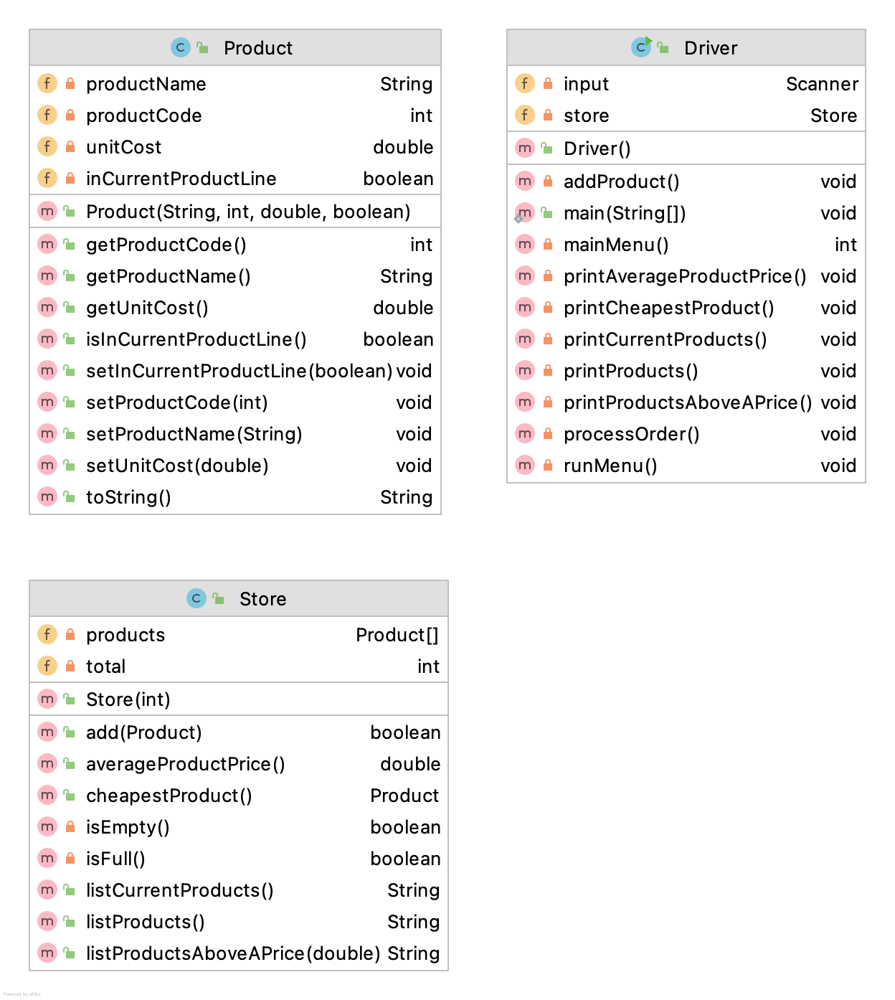

# Similar(ish) Projects

In your previous labs, you worked on a Shop project.  Your assignment will be similar(ish) to this project but will need more work

The solution to the Shop V2.2 project can be found [here](archives/ShopV2.2.zip).

The  full set of classes in the  Shop  Project is:

The *responsibility* of the *Product* class is to manage a single product. 

The *responsibility* of the *Store* class is to manage an array of Products.

The *responsibility* of the *Driver* class is to manage the I/O with the console (including the menu).

Please use this code as a support for developing your CourseSys app.

