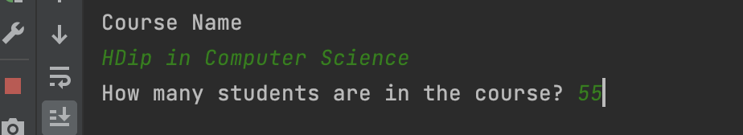
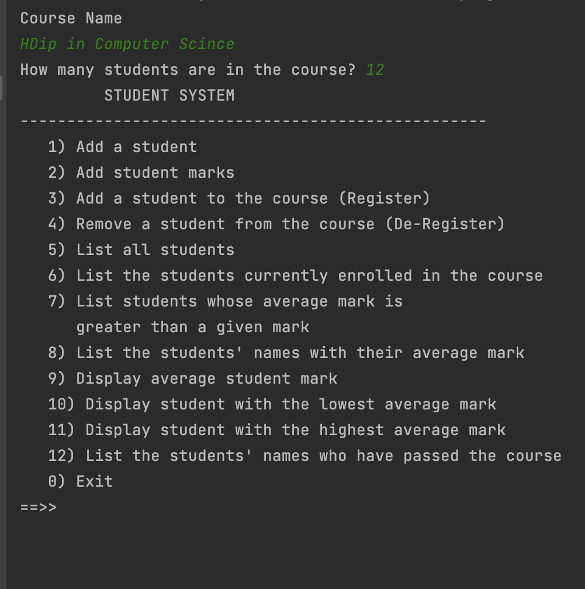
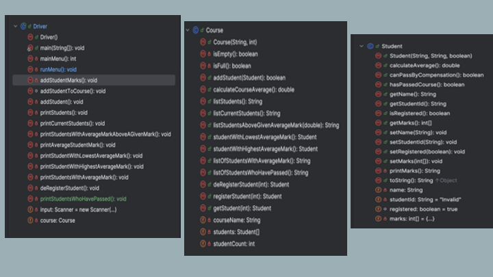

# Assignment Overview

You are tasked with developing a *Student Course System* Menu Driven App

When you first run the system, the user is asked for the Course name and the number of Students: 

You will then be shown a menu on the screen

Here are a few rules associated with the app:

- The course can have 0 to 30 students.  

- Students on a course can be registered or not registered, only registered students can have pass the course

- Each student has 6 (integer) marks (these will be stored in a primitive array). 

# Classes in the System

The *Course Sys* app will have three main classes :

- *Student*:  The responsibility for this class is to manage a single student in the System.  

- *Course*: The responsibility for this class is to store and manage all the students in the system on a course.

- *Driver*: The responsibility for this class is to manage the User Interface (UI) i.e. the menu and user input/output.

# Instructions for Developing System

The instructions for developing the system and the above classes are on the following tabs. 

We recommend, that you read the ENTIRE specification BEFORE starting to code. 

