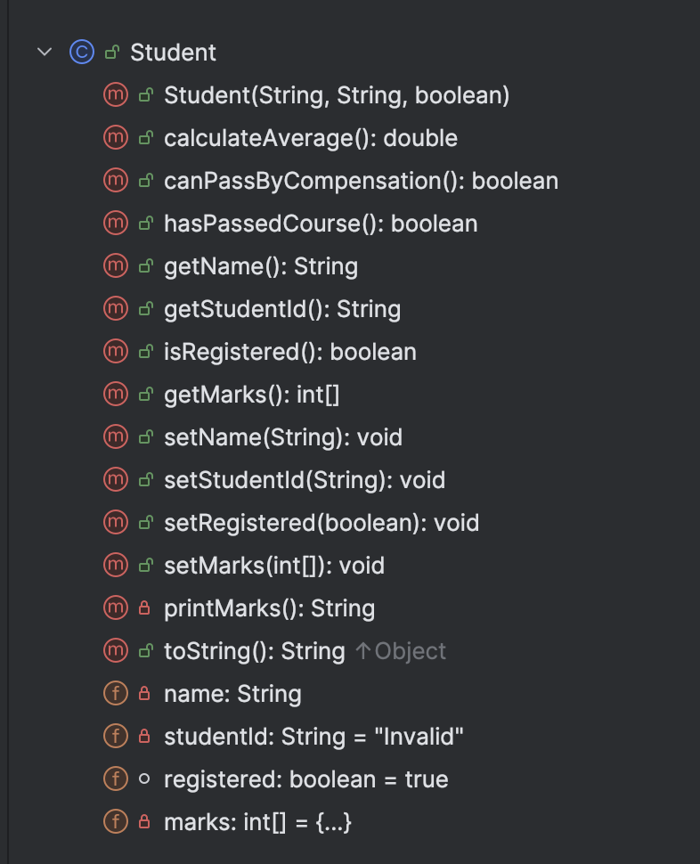

# Student class

The responsibility for this class is to manage a single Student in the system.  

** Remember, as soon as you enter the fields in a class in IntelliJ, you can GENERATE getters, setters, constructors and toString methods.  They are only basic methods and may need to be modified e.g. to add validation, change the format of the generated toString, etc.**

---

# Fields

There are four private fields in the Student class:

- *name*: The student name is maximum 20 characters.  When creating a new student, if the String is longer than 20 characters, you shoud truncate the string to the first 20 chars (**Hint** see String method *substring()* for a good  way to do this).   When updating (setter)*name*, you should only update if the length is less than or equal to 20.  

- *studentId*. This is an String that must be 8 chars long. The default value is "Invalid".

- *marks*. This is a primitive array of integers and is of size 6, one mark for each module for the course. Validation on each of these marks - each of these ratings must be between 0 and 100 (inclusive) - default to 0. 

- *registered*: A boolean value, set to false if the student is not currently registered, true otherwise. 

---

# Methods

- Ensure that the constructor and mutators adhere to the validation rules listed above.  

- Sample output from the toString is below:

- `calculateAverage()` - calculates average of student grades

- `canPassByCompensation()` - See [Rules of Compensation Tab](/lab/prog-fund-1-sept-24/topic00-assignments/book-2/Rules%20of%20Compensation) tab for more information

- `hasPassedCourse()` - returns true if all modules are 40 or greater, or can pass by compensation otherwise returns false

- `printMarks()` - returns a list of students grades on a line, with a tab between each grade

