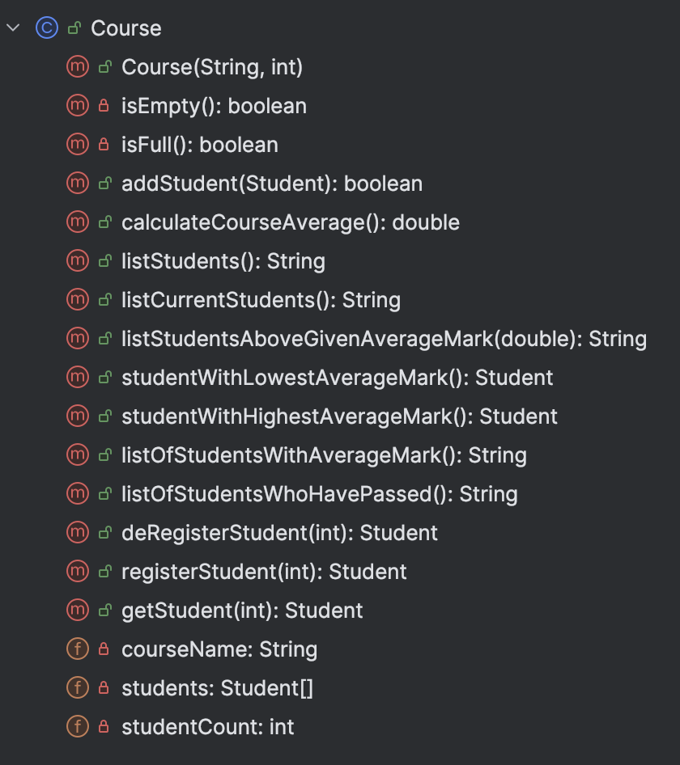

# Course Class

The responsibility for the Course class is to manage an array  of students.

---

# Fields

There are two private fields in the class:

- *students*: This is the array of Student in the app. 

- *courseName*: This is the name of the Course 

- *studentCount*: This is the number of students on the course (i.e. the size of the array)

---

# Constructor, getter and setter

You should write getters and  setters as per UML diagram - there is no setter needed for studentCount as it would not be appropriate to change its value.

---

# Listing methods 

- `listStudents()` - returns the string containing all students' details. 

- `listCurrentStudents()` -  returns a string containing all the details of all the students that are currently registered on the course. 

- `listOfStudentswithAverageMark()` - returns a string containing each student with their name and average mark (no more details required.)

- `listStudentsAboveGivenAverageMark(double)`
Given a value, return a string containing all the details of the students whose average mark is greater than the inputted mark. 

- `listStudentsWhoHavePassed()` - returns a string containing all the details of all the students who have passed

---

# Calculation methods 

- `studentWithLowestAverageMark()` - returns one student with the lowest average mark (if any students exist), null otherwise. 

- `studentWithHighestAverageMark()` - returns one student with the highest average mark (if any students exist), null otherwise. 

- `calculateCourseAverage()`
This calculates and returns the average of all the students' average marks.

# Other Methods

-  `deRegisterStudent(int indexToDeRegister) `
This method checks that the index passed as a parameter is valid.  If it is:
 
 - valid, the student is retrieved and assuming the student IS currently registered, the student is then deregistered and the student object is returned.  If the student exists, but is already not registered, return null. 
 - invalid, return null.

-  `registerStudent(int indexToRegister) `
This method checks that the index passed as a parameter is valid.  If it is:
 
 - valid, the student is retrieved and assuming the student IS NOT currently registered, the student is then registered and the student object is returned.  If the student exists, but is already  registered, return null. 
 - invalid, return null.
- `isEmpty()`
This method checks if the students array is empty (can be used in listing methods). It returns 
    - true if there are no students in the array (studentCount == 0)
    - false otherwise

- `isFull()`
This method checks if the students array is full (can be used in adding methods). It returns 
    - true if there are no available spaces in the array (studentCount == students.length)
    - false otherwise

