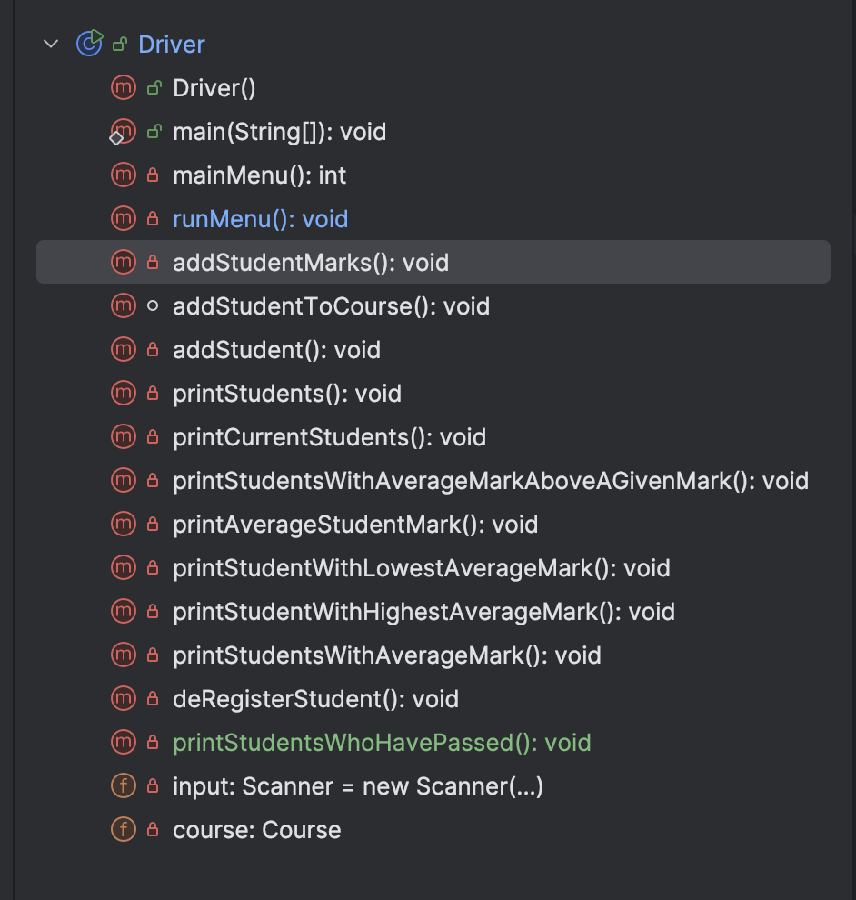

# Driver Class

The responsibility of the Driver class is to run the app and perform I/O with the user.  It is the only class that should have:

- System.out.print statements
- Scanner method calls.

# Fields

There are two  private fields in the *Driver* class:

- **course**: this holds and manages the collection (array) of *students*. The user will be asked to input the number of students. This value should be used to instantiate the array to that size. 
- **input**: the Scanner object for reading from the user.

# main method

The main method has one line of code:

~~~
new Driver();
~~~

## Constructor

We will write a default constructor for this class.  There is one line of code in this method:

~~~
public Driver() {
        runMenu();
    }
~~~

# Menu Displayed

Using the same approach adopted when deveoping the Shop projects, the following menu is *continually* displayed to the user: 

Note that the *mainMenu()* method displays the above menu and returns the user choice.  The *runMenu* method is the one that contains the switch statement that processes the user choice.  

A desciption of each menu option is on the next tab.

