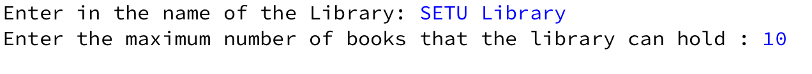
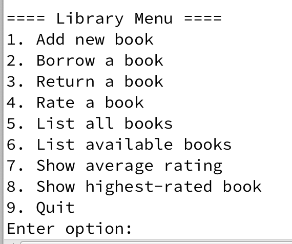
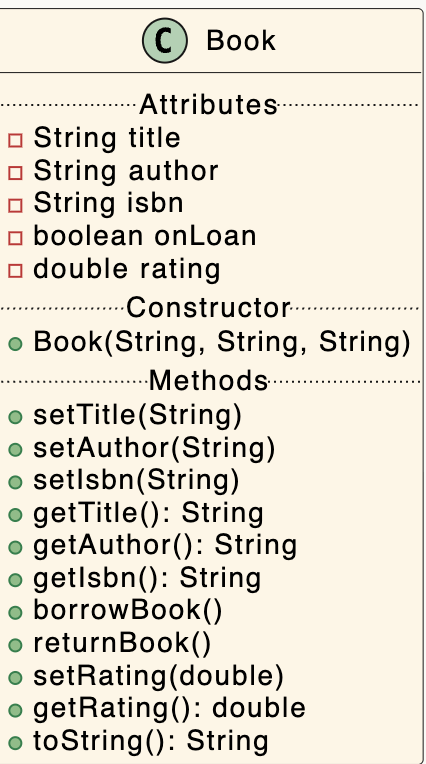

# Assignment Overview

You are tasked with developing a *Team System* Menu Driven App

When you first run the system, the user is asked how many players are on the team: 

You will then be shown a menu on the screen

Here are a few rules associated with the app:

- The library can hold a maximum of 100 books.

# Classes in the System

The *Library  System* app will have three main classes :

- *Book*:  The responsibility for this class is to manage a single book in the System.  

- *Library*:  The responsibility for this class is to store and manage the collection of all the books  in the system.

- *LibraryDriver*: The responsibility for this class is to manage the User Interface (UI) i.e. the menu and user input/output.

# Instructions for Developing System

The instructions for developing the system and the above classes are on the following tabs. 

We recommend, that you read the ENTIRE specification BEFORE starting to code. 

