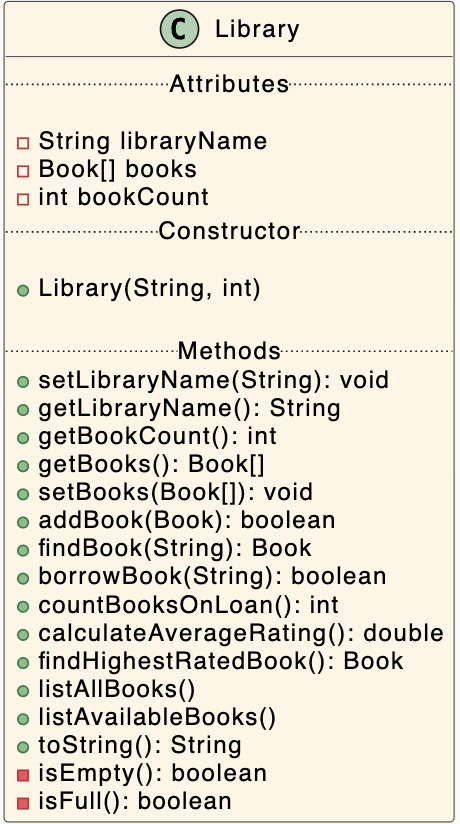

# Library Class

The responsibility for the Library class is to manage an array  of players.

---

# Fields

There are three private fields in the class:

- *libraryName*: This is the name of the library

- *books*: This is the array of Book in the app.  

- *bookCOunt*: This is the number of books currently in the libraryv(the size of the populated array).

---

# Constructor, getter and setter

You should write getters and  setters as per UML diagram - there is no setter needed for bookCount as it would not be appropriate to change its value.

---

# Listing methods 

- `listAllBook()` - returns the string containing all the books' details. 

- `listAvailableBooks()` -  returns a string containing all the details of all books that are available, i.e. not out on loan. 

---

# Calculation methods 

- `countAllBooksOnLoan()` - returns number of books currently on loan.

- `calculateAverageRating()` - returns the average rating of all the books in the library.

- `findHighestRatedBook()`
This calculates  and returns the book with the highest average rating. (If there are multiple books with the same average rating, return the the first one in the list)

# Other Methods

- `addBook(Book book)`
This method adds a book to the library. It returns true if the book was successfully added, false if not.

- `findBook(int isbn)` 
This method attempts to find a book in the library by its ISBN. It returns the book if found, or null if not found.

- 

-  `borrowBook(int isbn)`
This method attempts to borrow a book from the library. The input parameter is the ISBN of the book to be borrowed. It returns the following:
 
 - true if the book was successfully borrowed. That ism if the book is currently available (not on loan). If the book is successfully borrowed, the **onLoan** variable of the book isset to true 
 - false if the book is already on loan.

- `isEmpty()`
This method checks if the books  array is empty (can be used in listing methods). It returns 
    - true if there are no books  in the array 
    - false otherwise

- `isFull()`
This method checks if the books array is full (can be used in addBook method). It returns 
    - true if the array is full
    - false otherwise