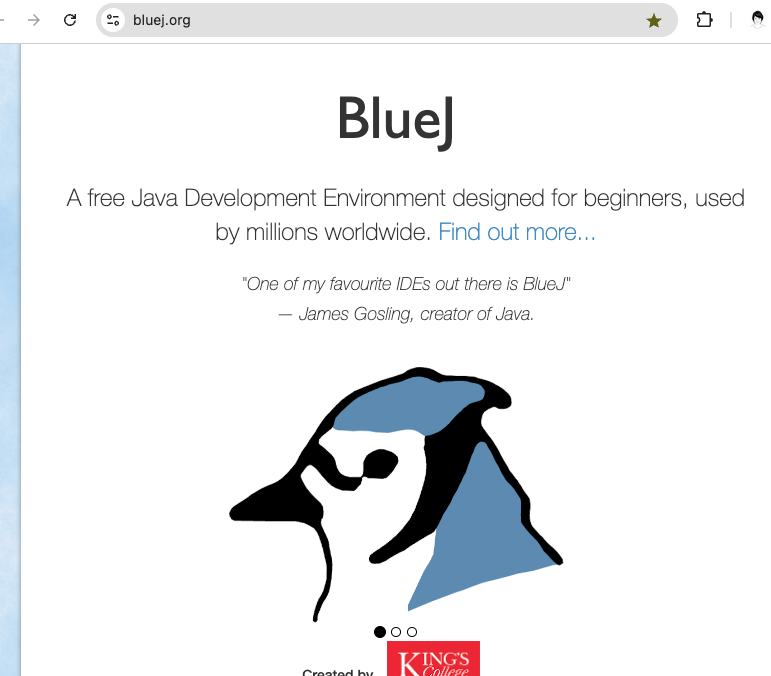
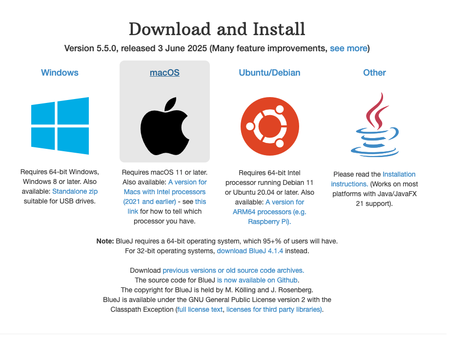
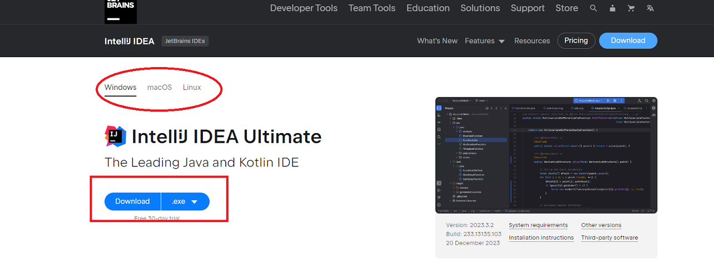
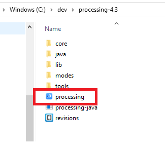

# Installing BlueJ Development Environment

- If you are using your own laptop and would like to install Bluej on it, please follow the instructions in this step.
- If you are using the SETU computers, you can ignore this step and move onto the next step.

## Downloading BlueJ

- Bluej can be downloaded from 
https://www.bluej.org/ . It is free.

- Scroll down and you will see the following suite of download options:   

- Choose the version of BlueJ that you would like to install.

- For Windows users you can follow the instructions on the screen. If you need more  help, you can watch this video from the BlueJ website: [here](https://youtu.be/so8_fCKTlFo?si=uVaccVBlzIW6tdk_). Any problems, contact us by Slack or in class. 

- For Mac Users:

[( https://www.bluej.org/doc/video-tutorials.html) : 
   - Decide where you are going to store your Programming applications on your computer.   It is a good idea to create a folder called **dev** on your **C:** and store all your applications in there.
   - Unzip the downloaded processing file to your chosen location.  Note: if you don’t have unzipping software, 7-zip is a good choice and can be downloaded from here: http://www.7-zip.org/.
   - You should now have a folder structure resembling this picture:

## Mac
   - Unzip the downloaded .zip file (by double-clicking on the zip file in the downloads folder)
   - Drag the resulting folder to the Applications folder (on Mac, this holds all the applications). Note that it is useful/usual to have the Applications Folder in the 'Favourites' section in Finder. 

   - Your Applications folder should now contain the Processing application. 
