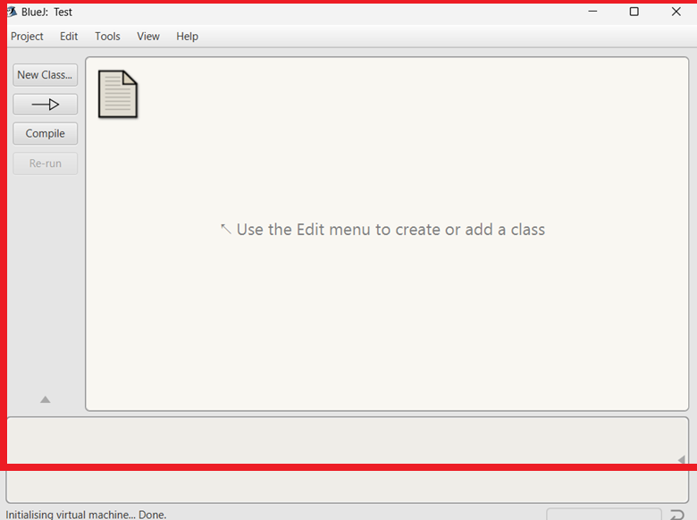
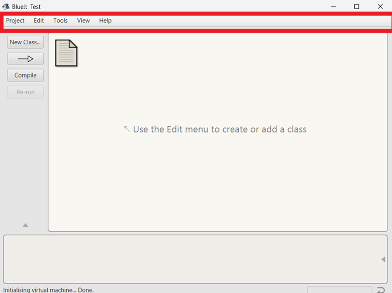
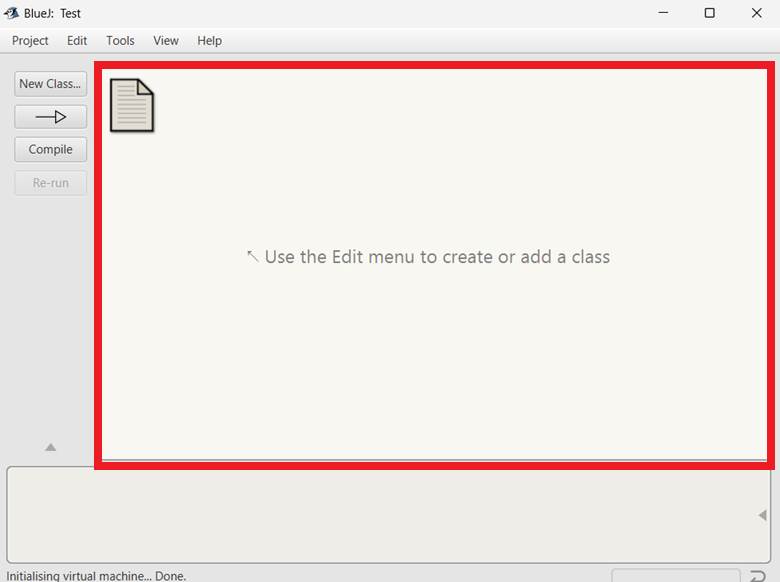
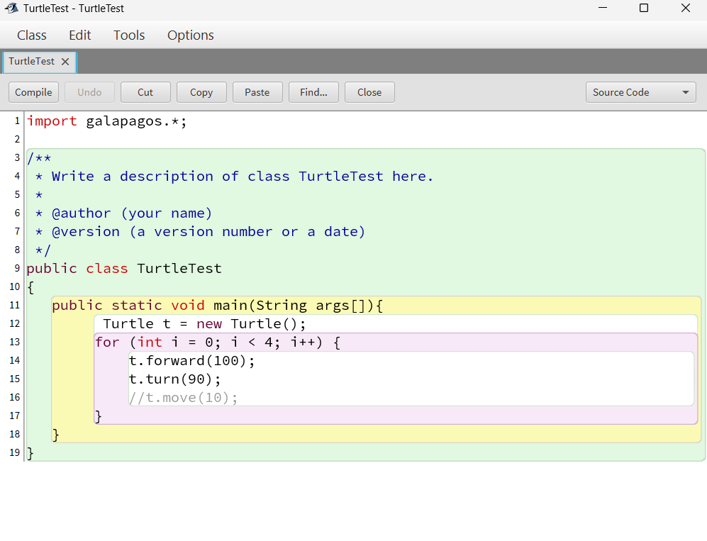
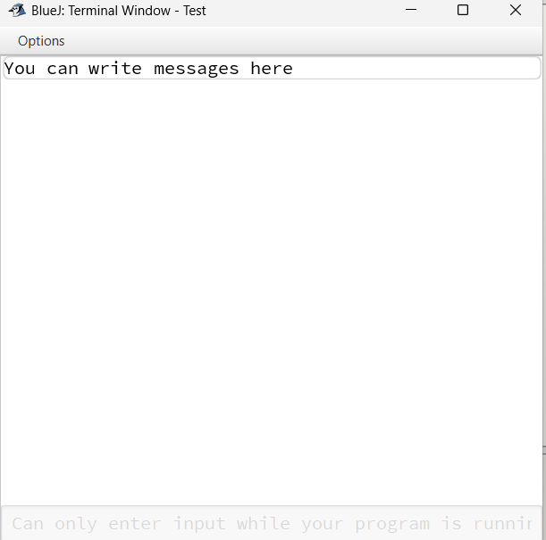

# Getting to know BlueJ

## Finding BlueJ on Your Computer

**On Windows:**

1\. Click the Start Menu (Windows icon in bottom-left).
2\. Type BlueJ into the search bar.
3\.Click on the BlueJ application from the results.

**On macOS:**

1\. Open Finder.
2\. Go to Applications.
3\. Locate BlueJ in the list.
4\. Double-click to launch.

 If BlueJ is not installed, download it from the official website: https://bluej.org

## The BlueJ Interface

When you open BlueJ, you’ll see its simple, beginner-friendly interface.

**Project Window**

- Shows the classes in your project as boxes.
- New projects start empty.

**Toolbar**

- Options for creating projects, opening projects, compiling, and running.

**Class Diagram Area**

- Visual representation of your classes. 
- Each class appears as a box with its name.

**Editor Window**

- Opens when you double-click a class.
- Where you write and edit your Java code.

**Terminal / Code Pad**

- Output window for running programs.
- Can also be used for testing code snippets.

