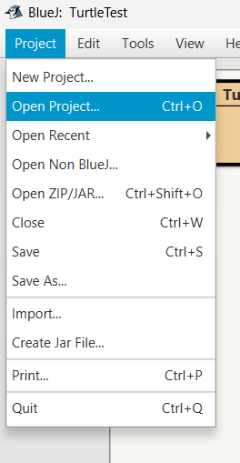
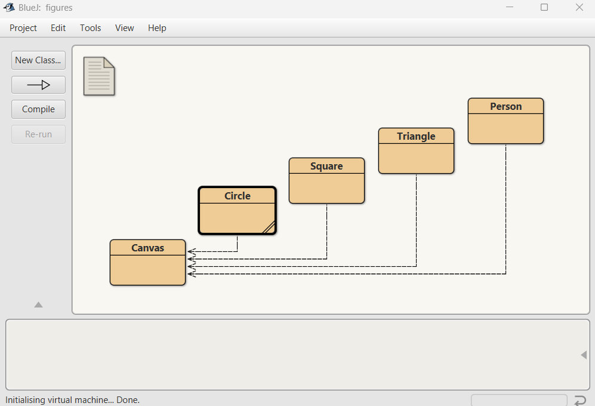
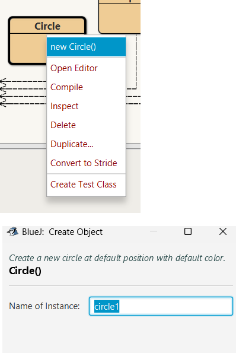
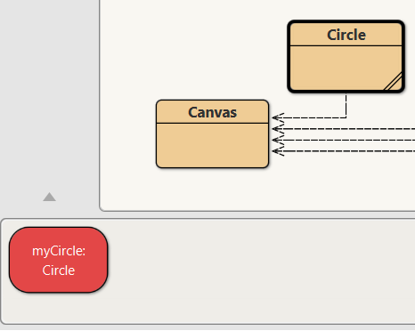

# Getting Started

- Download the sample project [Figures](archives/figures.zip). 
- Extract it and note where you have saved it to (you can use your OneDrive)
- Open BlueJ
- On the Toolbar go to Projects -> Open Projects
    
- Find where you saved the figures project an open it
- It should look like this (if not ask!)
    

## Lets create some objects
- We Right-click a class (e.g., Circle, Square, Triangle) to create an object.
    - So right-click on Circle and choose **new Circle**  
          
    - You will be asked to name it, call it **myCircle**
         
    

~~~
fill(0);
//line 1
rect(10,0,10,10);
rect(20,0,10,10);
rect(30,0,10,10);
//line 2
rect(40,10,10,10);
//line 3
rect(10,20,10,10);
rect(20,20,10,10);
rect(30,20,10,10);
rect(40,20,10,10);
//line 4
rect(0,30,10,10);
rect(40,30,10,10);
//line 5
rect(0,40,10,10);
rect(40,40,10,10);
//line 6
rect(10,50,10,10);
rect(20,50,10,10);
rect(30,50,10,10);
rect(40,50,10,10);
~~~

  