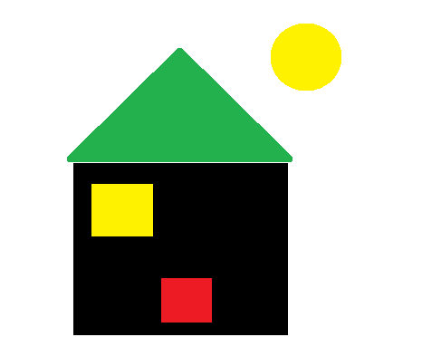
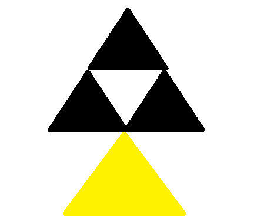

# Over to You

Can you draw your own image?

**Exercise 3** 
1\. Design your own image, you can use pen and paper to design it if you want
2\. Take a screen shot of the image you create and save it as a .png file
3\. Upload it to the dropbox on Moodle (https://moodle.setu.ie/mod/assign/view.php?id=4561771)

**Contact us if you can't upload it**

 

 
