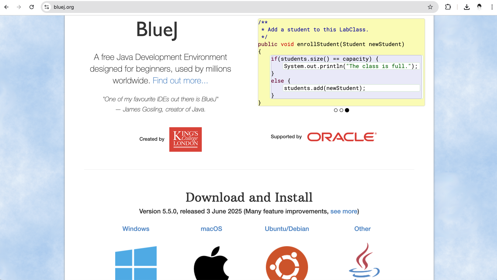

# Installing the BLueJ Development Environment

- If you are using your own laptop and would like to install the PDE on it, please follow the instructions in this step.
- If you are using the SETU computers, you can ignore this step and move onto the next step.

## Downloading the BlueJ Development Environment

- Bluej can be downloaded from https://www.bluej.org/.  It is free.

- Choose the version of the 

- Depending on your operating system, either an msi file or dmg in the case of Mac, will start to download.  When this file has downloaded, you can install the application by double-clicking on the file..

## Windows
   - Decide where you are going to store your Programming applications on your computer.   It is a good idea to create a folder called **dev** on your **C:** and store all your applications in there.
   - Unzip the downloaded blueJ file to your chosen location.  Note: if you don’t have unzipping software, 7-zip is a good choice and can be downloaded from here: http://www.7-zip.org/.
 

## Mac
   - Install the downloaded .dmg file (by double-clicking on the  file in the downloads folder)
   - Drag the resulting folder to the Applications folder (on Mac, this holds all the applications). Note that it is useful/usual to have the Applications Folder in the 'Favourites' section in Finder. 

   - Your Applications folder should now contain the Processing application. 

