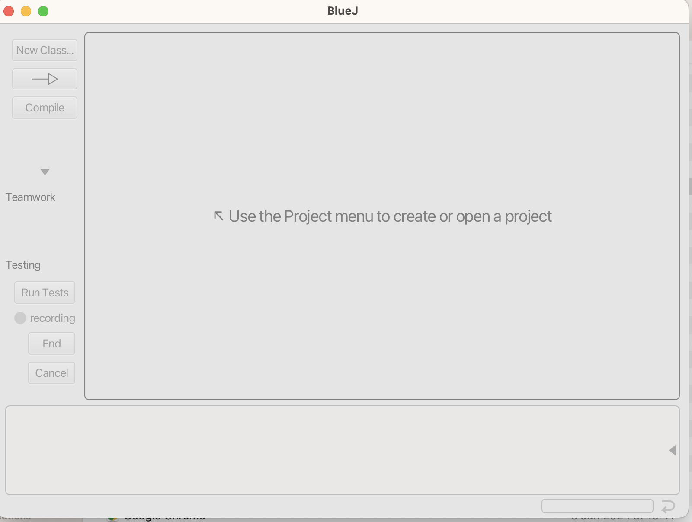

# Opening the BlueJ (Processing Development Environment)

## If you are using the College Computers...

Go to the search bar at the bottom row of the screen. Type in **BlueJ**. This should bring up the app for you. Double click on it to open the BlueJ app. 

## If you are using your own computer...

## Using Windows. - TODO CHANGE IMAGE
Go to the directory/folder where you installed your BlueJ app.  

### Opening BlueJ

Now that you have nagivated to where BlueJ is installed, you should see a list of files and folders similiar to the picture below:

(This is a screen shot using a MacBook - if you are using a labtop move the BlueJ file/icon to a similar folder e.g. dev if you have not already done so.)

Double click in the **BlueJ** application (highlighted by the red rectangle).

The BlueJ application should launch.

## Using Mac Os X

Your BlueJ app should be in your Applications folder.  

Double click on it to open the BlueJ app and it should launch.

# Bluej Workflow
#### [Made by Mairead Meagher with Scribe](https://scribehow.com/shared/Bluej_Workflow__AU6qPfprQxCnrd-Y5u_1Mg)

1\. So firstly, we create a new project. And when we're creating new project, we get to choose. We choose an appropriate folder for the project and then the name of the project.

2\. A place for this to go, so I'm just going to put it into.

3\. Double-click "text field"

4\. Where I need it for the labs.

5\. Double-click "cell"

6\. Click "cell"

7\. Click "cell"

8\. Double-click "text field"

9\. Click "Open"

10\. Click "text field"

11\. And I'll just call it test one.

12\. Click "BlueJ:  test1"

13\. And then. Now that I have that in there, I'm just going to put new class and I'm going to call it test.

14\. And it is Java. I'm looking at Java, so I'm going to. Keep class and then just go. Okay. And if we look at. Okay, you can see.

15\. The diagonal lines there. That just means it's not compiled yet. But we'll have a look at it first to see what's there. And you can see this kind of very basic.

16\. Test. But. You have just a constructor. And the sample method there. So what we can do there is we can compile that.

17\. Once we've decompiled, that means. The grammar is correct. And then we right click on that and if I just say new test. What that's. Going to do is it's going to run this.

18\. Double-click "Test Class: Compiled"

19\. Click "text entry area"

20\. Click here

21\. We'll need to do a new test to create this new object down here. I'll call it test one.

22\. Click "new Test()"

23\. Click "OK"

24\. And that's this object here and here. Now you can see that we can try the sample method. And to do that, I need to put in a number.

25\. Click "int sampleMethod(int y)"

26\. Click "OK"

27\. And that will give me back that number. Returned. Okay, and we can close that and. Test that on.

#### [Made with Scribe](https://scribehow.com/shared/Bluej_Workflow__AU6qPfprQxCnrd-Y5u_1Mg)

