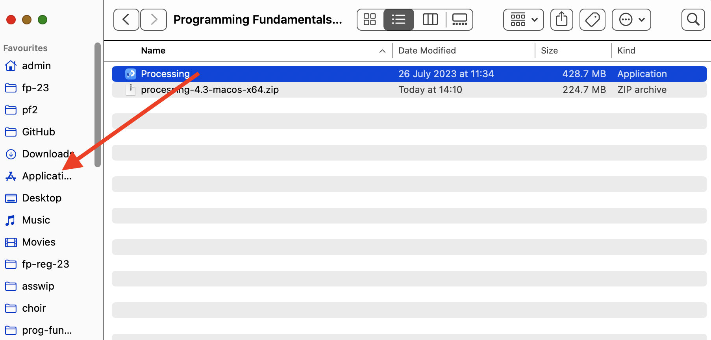

# Opening the PDE (Processing Development Environment)

## If you are using the College Computers...

Go to the search bar at the bottom row of the screen. Type in **Processing**. This should bring up the app for you. Double click on it to open the Processing app. 

## If you are using your own computer...

Go to the directory/folder where you installed your processing app.  

## Opening the PDE

Now that you have nagivated to where Processing is installed, you should see a list of files and folders similiar to the picture below:

(This is a screen shot using a MacBook - if you are using a labtop move the Processing file/icon to a similar folder e.g. dev if you have not already done so.)

Double click in the **processing** application (highlighted by the red rectangle).

The PDE (Processing Development Environment) should launch.

