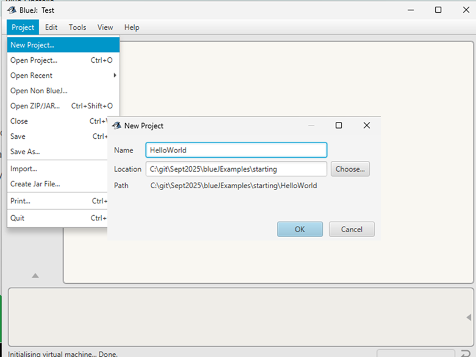
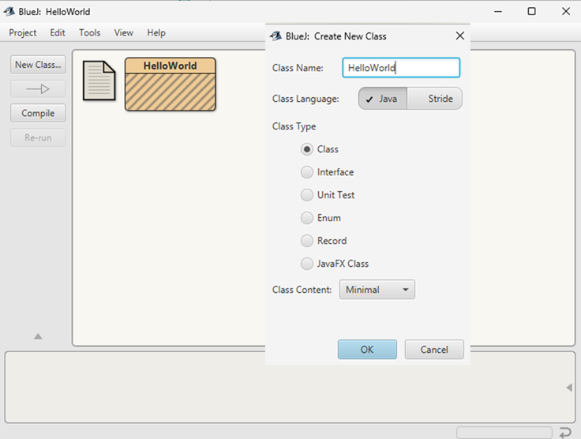

# Create a class

## Understand the Structure of a Java Program

Every Java program has:

- A class (the building block of Java code).

- A main method – the starting point where the program runs.

## Step 1: Open BlueJ

- Start BlueJ.

- From the menu, select Project → New Project….

- Give the project a name (e.g., HelloWorldProject).

- Choose a folder to save it in.

## Step 2: Create a New Class

- In your new project window, click New Class….

- Name the class HelloWorld (with a capital H and W).

- BlueJ will create a file called HelloWorld.java for you.

## Step 3: Write the Program

- Double-click the new HelloWorld class to open the editor.

- Delete the default code BlueJ provides.

- Type this code exactly:

~~~   
    public class HelloWorld {
    public static void main(String[] args) {
        System.out.println("Hello, World!");
    }
}
~~~

## Step 4: Compile the Program

- Click the Compile button in the editor, or click Compile in the main project window.

- If there are no errors, the class box in the project window will turn from striped to solid.

## Step 5: Run the Program

- Right-click on the HelloWorld class in the project window.

- From the menu, select void main(String[] args).

- A dialog will appear — click OK to run it.

- In the BlueJ terminal window, you should see:

~~~
Hello, World!
~~~

## Step 6: Experiment

Change the text inside the quotation marks. For example:

~~~
System.out.println("My name is ___");
~~~

Compile and run the program again.

Add another line of output:

~~~
System.out.println("I am learning Java in BlueJ!");
~~~

**Congratulations** You have now written, compiled, and run your first Java program in BlueJ.