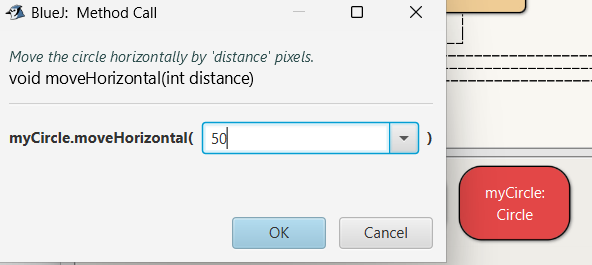

# Understanding Objects

- Download the sample project [Figures](archives/figures.zip). 
- Extract it and note where you have saved it to (you can use your OneDrive)
- Open BlueJ
- On the Toolbar go to Projects -> Open Projects
- Find where you saved the figures project and open it

## Create some objects
- We Right-click on a class (e.g., Circle, Square, Triangle) to create an object.
    - So right-click on Circle and choose **new Circle**  
    - You will be asked to name it, call it **myCircle**
        
## Passing parameters to methods
Invoke the **moveHorizontal()** method. You will see dialog appear that prompts you for some input. 

Type in 50 and click Ok.

You will see the circle move 50 pixels to the right.

The moveHorizontal method that was just called is written in such a way that it requires some more information to execute. In this case, the information required is the distance – how far the circle should be moved. Thus, the moveHorizontal method is more flexible than the moveRight or moveLeft methods. The latter always move the circle a fixed distance, whereas moveHorizontal lets you specify how far you want to move the circle.

**Class Exercise 1** - Try invoking the moveVertical, slowMoveVertical and changeSize methods before you read on. Find out how you can use moveHorizontal to move the circle 70 pixels to the left.

The additional values that some methods require are called **parameters**. A method indicates what kinds of parameters it requires. When calling, for example, the moveHorizontal method, the dialog displays the line near the top. 
~~~
void moveHorizontal(int distance)
~~~
This is called the **signature** of the method. The signature provides some information about the method in question. The part between the parenthesis (int distance) is the information about the required parameter. For each parameter, it defines a type and a name. The signature above states that the method requires one parameter of type int named distance. 

The name gives a hint about the meaning of the data expected.

