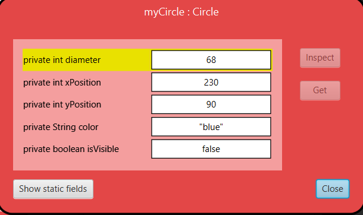

# Data Types

A type specifies what kind of data can be passed to a parameter.

The type **int** signifies whole numbers (also called **integer** numbers, therefore the abbreviation **int**).
In the previous example, the signature of the moveHorizontal method states that, before the method can execute, we need to supply a whole number specifying the distance to move. 

The **String** type indicates that a section of text (for example a word or a sentence) is expected. Strings are always enclosed within double quotes. For example, to enter the word red as a string, type
~~~
"red"
~~~
**Class Exercise 2** - Invoke the changecolour method on one of your circle objects and enter the String “red”. This should change the colour of the circle. Try other colours.

**Class Exercise 3** - This is a very simple example, and not many colours are supported. See what happens when you specify a colour that is not known.

**Class Exercise 4** - Invoke the changeColor method, and write the colour into the parameter field without the quotes. What happens?

# Multiple Instances
Once you have a class, you can create as many objects (or instances) of that class as you like. From the class Circle, you can create many circles. From Square, you can create many squares.

Every one of those objects has its own position, colour and size. You change an attribute of an object (such as its size) by calling a method on that object. This will affect this particular object, but not others.

**Class Exercise 5** - Create several circle objects on the object bench. You can do so by selecting new Circle() from the popup menu of the Circle class. Make
them visible, then move them around on the screen using the **move** methods. Make one big and yellow, make another one small and green.

Try the other shapes too: create a few triangles and squares. Change their positions, sizes and colours

## State

The set of values of all attributes defining an object (such as xposition, y-position, colour, diameter and visibility status for a circle) is also referred to  as the object’s state. This is another example of common terminology that we will use from now on.

In BlueJ, the state of an object can be inspected by selecting the Inspect function from the object’s popup menu. 

This window is called the object inspector.

**Class Exercise 5** - Make sure you have several objects on the object bench and then inspect each of them in turn. Try changing the state of an object (for
example by calling the moveLeft method) while the object inspector is open. You should see the values in the object inspector change.

# What is an Object?

On inspecting different objects you will notice that objects of the same class all have the same fields. That is, the number, type and names of the fields are the same, while the actual value of a particular field in each object may be different. In contrast, objects of a different class may have different fields. A circle, for example, has a field **diameter**, while a triangle has fields for **width** and **height**.
