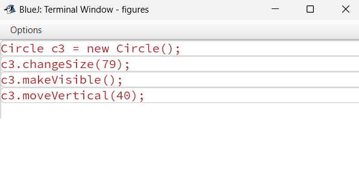
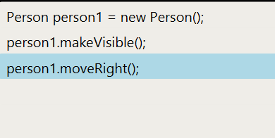

# Java Code

When we program in Java, we essentially write down instructions to invoke methods on objects, just as we have done with our figure objects above. However, we do not do this interactively by choosing methods from a menu with the mouse, but instead we type the commands down in textual form. We can see what those commands look like in text form by using the BlueJ Terminal.

**Class Exercise 5** - Select Show Terminal from the View menu. This shows another window that BlueJ uses for text output. Then select Record method calls from
the terminal’s Options menu. This function will cause all our method calls (in their textual form) to be written to the terminal. Now create a few objects, call some of their methods, and observe the output in the terminal window.

Instead of just looking at Java statements, we can also type them. To do this, we use the Code Pad. (You can switch off the Record method calls function now and close the terminal.)

**Class Exercise 6** - Select Show Code Pad from the View menu. This should display a new pane next to the object bench in your main BlueJ window. This pane is the **Code Pad**. You can type Java code here.

**Class Exercise 7** - In the Code Pad, we can type Java code that does the same things we did interactively before. The Java code we need to write is exactly like that shown below.

In the Code Pad, type the code shown above to create a  object and call its makeVisible and moveRight methods. Then go on to create some other objects and call their methods.

Typing these commands should have the same effect as invoking the same command from the object’s menu. If instead you see an error message, then you have mistyped the command.

Check your spelling. You will note that getting even a single character wrong will cause the command to fail.