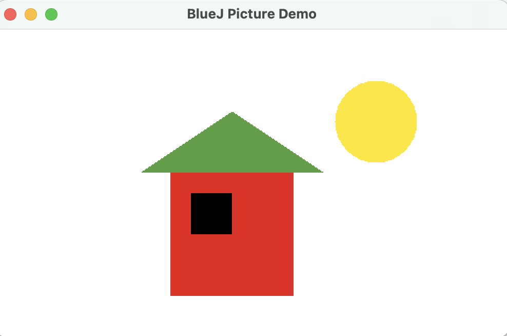

# Object Interaction

- For the next section, we shall work with a different example project. Close the *figures* project if you still have it open.
and open the project called picture.
- Download the sample project [picture](archives/picture.zip). 

- Extract it and note where you have saved it to (remember to use your filing system correctly).
- Open the project in BlueJ.

**Class Exercise 8** 
Open the **picture** project. Create an instance of the Picture class  and invoke its **draw()** method. Also, try out the  other  methods. How do you think the  class draws the picture?

**The Picture Class** 

The  class is written so that, when you create an instance, the instance creates two square objects (one for the wall, one for the window), a triangle, and a circle. Then, when you call the  **draw** method, it moves them around and changes their colour and size, until the canvas looks like the picture we see in: 

.

In the next tab, we will see how this picture was created and how we can add details to the picture.

