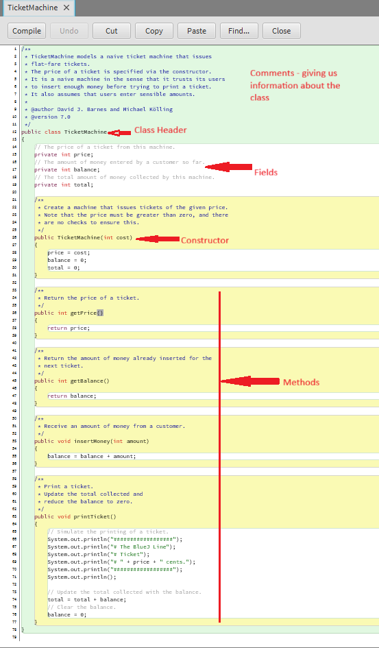

# Examining a Class Definition

Examination of the behaviour of TicketMachine objects within BlueJ reveals that they only really behave in the way we might expect them to if we insert exactly the correct amount of money to match the price of a ticket. As we explore the internal details  the class in this section, we will begin to see why this is so.
Take a look at the source code of the TicketMachine class by double-clicking its icon in the class diagram. 

**Note how the code is laid out**

 

