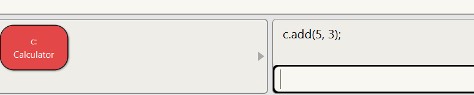

# Challenges

## Challenge 1 - Create a simple Calculator

- You are asked to create a Calculator class that can add, substract, multiply and divide 2 integer numbers.
- You do not need to store the numbers in fields, so this class will only have the 4 methods as described above.
- Each method will accept 2 int parameters and print the answer to the screen
    Exammple:
~~~ 
    public void add(int a, int b)
    {
        System.out.println( a + b);
    }
~~~ 

Once you have created the class, compile it and using BlueJ create an object.  YOu can call each of the methods by right-clicking on the object and passing the values to the method.  Ensure that the correct value is being printed to the screen.

## Challenge 2 - Call the methods from the Code Pad

  

Write the method calls in the Code Pad window for each method

## Challenge 3 - Create a new method to add 3 integers
You can name the method add3, it should accept 3 integers and print the result, test your method as above

## Challenge 4  - Create another class that uses the Calculator class
- Create a new class called UseCalculator
- This class will have a main method, 
    - creates a Calculator object
    - calls the add and subtract methods

This is very advanced, so should only be attempted if you have a good understanding of objects and how they work together

