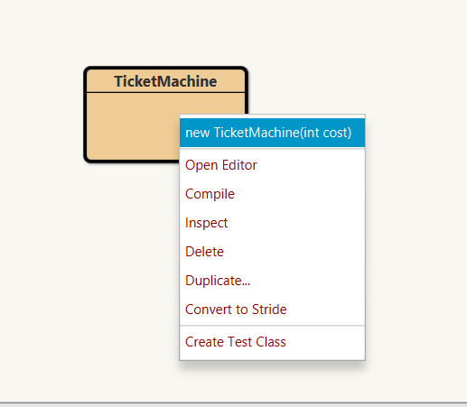
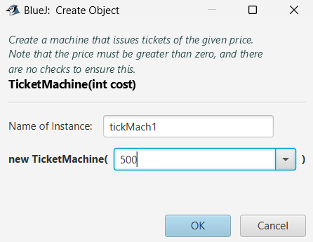

# Exploring Behaviour of a Naive Ticket Machine

Our ticket machines work by customers ‘inserting’ money into them, and then requesting a ticket to be printed. The machine keeps a running total of the amount of money it has collected throughout its operation.

## Getting Started

Open the naive-ticket-machine project in BlueJ. [Naive Ticket Machine](archives/figures.zip). 

This project contains only one class **TicketMachine** 

When you create a TicketMachine instance, you will be asked to supply a number that corresponds to the price of tickets that will be issued by
that particular machine. The price is taken to be a number of cents, so a positive
whole number such as 500 would be appropriate as a value to work with.

- Compile the TicketMachine class (understand why you need to do this)

- Create a new TicketMachine Object
    

- Give the Object a name and a price for the ticket (price in cents)
    

**Exercise 1:** 
 - Take a look at its methods. You should see the following: getBalance, getPrice,
insertMoney, and printTicket. 
- Try out the getPrice method. You should see a return value containing the price of the tickets that was set when this object was created. 
- Use the insertMoney method to simulate inserting an amount of money into the machine
- Use getBalance to check that the machine has a record of the amount
inserted. 
- You can insert several separate amounts of money into the machine, just like you might insert multiple coins or notes into a real machine. Try inserting the exact amount required for a ticket. As this is a simple machine, a ticket will not be issued automatically.
-  Once you have inserted enough money, call the printTicket method. A ticket should be printed in the BlueJ terminal window

    

**Exercise 2:** What value is returned if you check the machine’s balance after it has printed a ticket?

**Exercise 3:** Experiment with inserting different amounts of money before printing tickets. Do you notice anything strange about the machine’s behaviour? What happens if you insert too much money into the machine – do you receive any refund? What happens if you do not insert enough and then try to print a ticket?

**Exercise 4:** Try to obtain a good understanding of a ticket machine’s behaviour by interacting with it on the object bench before we start looking at how the TicketMachine class is implemented in the next section.

**Exercise 5:** Create another ticket machine for tickets of a different price. Buy a
ticket from that machine. Does the printed ticket look different?
