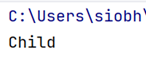

# Conditional statements  - if - else

In this step, we will implement an example from your lecture.

Anyone less than 19 is a child and everyone else is an adult

    age < 19 - child

    Otherwise adult

## Class Example 1

Create a new project in BlueJ and call it **Week4-Class-Exercises**

Create a new class called IfStatementsExample1

~~~java
 public static void main(String[] args) {
        int age = 5;
        if (age < 19) {
            System.out.println("Child");
        }
        else {
            System.out.println("Adult");
        }
    }
~~~

- Run your code.  Does it work as you would expect?

Change the value stored in age to 20, whats happens?  Why?