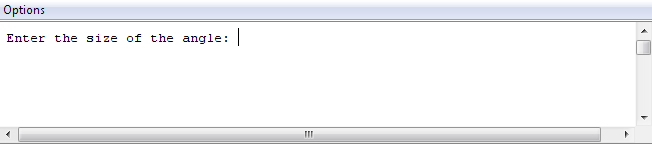
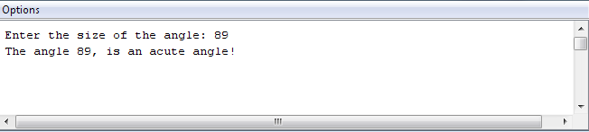
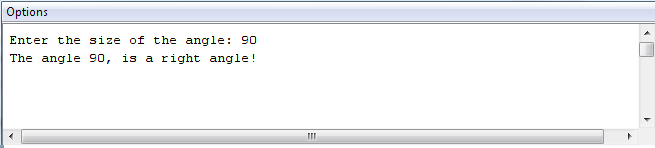
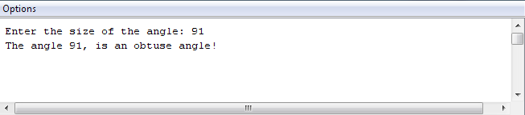
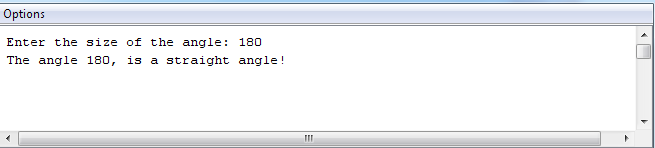
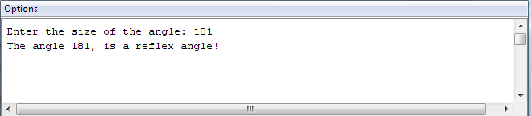

# Exercise on Scanner
 
This exercise will help you become more familiar with the Scanner class.

## What are you being asked to do?

Write a single class app that uses Scanner to ask the user to type in the value of an angle: 

If the angle is less than 90, print out acute angle, e.g.:

If it is exactly 90, print out right angle, e.g.:

If it is more than 90 but less than 180, print out obtuse angle, e.g.:, 

If it is exactly 180, print out straight angle, e.g.:

If it is otherwise, print out reflex angle, e.g.:

## How do I code that?

In **Week4-Class-Exercises**, create a new class  called **AngleProject**.

Import the Scanner class; recall that this must be the first line in your file.

Add a **main** method to the class and in this method:

- Create an object of the Scanner class.

- Ask the user to enter an angle and store it (you can determine the variable type from the screen shots above).

- Write an if stmt to determine what type of angle it is.

## Run the Code and Check the Output

Run the code and check the output; does all work as expected?

