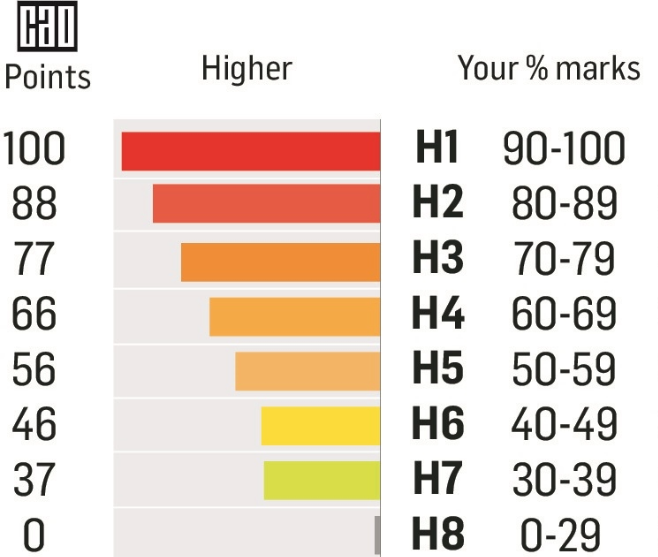

<div align="center">

<h1>Tutorial Sheet - Topic 04 </h1>
<h2>Programming Fundamentals 1</h2>

 Selection - If-Else, Precedence of Operators, Logical Operators, compound assignment statements

</div>


## Section 1: Arithmetic Operators & Order of Evaluation

### Question 1.1: Basic Arithmetic
Calculate the results of the following expressions:
```java
a) 10 + 5 * 2
b) (10 + 5) * 2
c) 20 / 4 + 3
d) 20 / (4 + 3)
e) 15 % 4 + 2 * 3
```

### Question 1.2: Compound Assignment
Rewrite the following statements using compound assignment operators:
```java
a) total = total + 10;
b) count = count - 1;
c) price = price * 1.2;
d) score = score / 2;
e) balance = balance + amount;
```

### Question 1.3: What's the Value?
If `x = 10` (before all of the following statements), what is the value of `x` after each statement?
```java
a) x += 5;
b) x -= 3;
c) x *= 2;
d) x++;
e) x--;
```

<div style="page-break-before: always;"></div>


## Section 2: Boolean Values & Conditions

### Question 2.1: True or False?
Given: `int age = 20; int price = 15; String name = "John";`

Evaluate whether these conditions are `true` or `false`:
```java
a) age >= 18
b) age < 18
c) price == 15
d) price != 15
e) age > 20
f) age <= 20
g) price > 10 && price < 20
h) age < 18 || age > 65
```


### Question 2.1: Boolean Variables
Complete the code by creating appropriate boolean variables:
```java
int temperature = 25;
int humidity = 80;

// Create boolean variables
boolean _______ = temperature > 30;
boolean _______ = temperature < 0;
boolean _______ = humidity > 70;
boolean _______ = isHot && isHumid;
```

---

## Section 3: Simple If Statements

### Question 3.1: Write Simple If Statements
Write if statements for the following scenarios:

a) If a person's age is 18 or over, print "You can vote"

b) If the price is negative, print "Invalid price"

c) If the score is 100, print "Perfect score!"

d) If the balance is 0 or less, print "Insufficient funds"


<div style="page-break-before: always;"></div>

### Question 3.2: Complete the Code
Fill in the missing parts:
```java
public void checkTemperature(int temp) {
    if (________) {  // temp is below 0
        System.out.println("Freezing!");
    }
}

public void validateAge(int age) {
    if (________) {  // age is between 13 and 19 inclusive
        System.out.println("Teenager");
    }
}
```

---
## Section 4: If-Else Statements


### Question 4.1 Pass or Fail
Write a method that checks if a student passed or failed:
- Score >= 40: Print "Pass"
- Score < 40: Print "Fail"

```java
public void checkResult(int score) {
    // Your code here
    
}
```

### Question 4.3: Even or Odd
Write code to determine if a number is even or odd:
```java
public void checkEvenOdd(int number) {
    // Hint: Use the % operator
    // Your code here
    
}
```

<div style="page-break-before: always;"></div>

## Section 5: If-Else-If Statements

### Question 5.1: Marks and Grades
Given the following grade categories:


Write a method **printGrade** person's a given mark, prints thehe grade (e.g. "H1", "H2", etc.)
```java

public void printGrade(int mark) {
    // Your code here
    
}
```
`
<div style="page-break-before: always;"></div>

### Question 5.2: Ticket Pricing
A cinema charges different prices based on age:
- Under 12: €6
- 12-64: €10
- 65 and over: €7

Write a method to calculate and print the ticket price:
```java
public double getTicketPrice(int age) {
    // Your code here
    
}
```

---

## Section 6: Compound Conditions (AND &&)

### Question 6.1: Valid Mark Range
Write code to check if a mark is valid (between 0 and 100 inclusive):
```java
public void validateMark(int mark) {
    // Your code here
    
}
```

### Question 6.2: Valid Mark Range -  boolean     method
Write a method similar to validateMark as above except that in this case the method returns a boolean value - true if the mark  is validbetween 0 and 100 inclusive and false otherwise.
```java
public boolean validateAgeBoolean(int age) {
    // Your code here
    
}
```

<div style="page-break-before: always;"></div>

### Question 6.3: Loan Eligibility
Write a method that checks (and prints) if a person is eligible for a loan.  A person is eligible for a loan if:
- Age is between 18 and 65 (inclusive)
- Has no existing loans

```java
public void checkLoanEligibility(int age,  boolean hasExistingLoan) {
    // Your code here
    
}
```
### Question 6.4: Loan Eligibility - boolean method
Write a method that checks if a person is eligible for a loan.  A person is eligible for a loan if:
- Age is between 18 and 65 (inclusive)
- Has no existing loans
The method returns a boolean value - true if the person is eligible for a loan and false otherwise
```java
public boolean checkLoanEligibilityBoolean(int age,  boolean hasExistingLoan) {
    // Your code here
    
}
```
---

<div style="page-break-before: always;"></div>

# Section 7: Compound Conditions (OR ||)

### Question 7.1: Invalid Mark
Write code to check if a mark is INVALID (less than 0 OR greater than 100):
```java
public void checkInvalidMark(int mark) {
    // Your code here
    
}
```

### Question 7.2: Weekend Day
Write code to check if a day is a weekend day (Saturday or Sunday):
```java
public void checkWeekend(String day) {
    // Your code here
    
}
```

### Question 7.3: Discount Eligibility
A customer gets a discount if they are a student OR a senior (65+):
```java
public void checkDiscount(boolean isStudent, int age) {
    // Your code here
    
}
```

<div style="page-break-before: always;"></div>

## Section 8: Compound Conditions (NOT !)

### Question 8.1: Voting Ineligibility
Write code using the NOT operator:
```java
boolean isEligible = false;

// If NOT eligible, print "Sorry you cannot vote"
// Your code here

```

### Question 8.2: Not Raining
Write code to suggest outdoor activities if it's NOT raining:
```java
public void suggestActivity(boolean isRaining) {
    // Your code here
    
}
```

### Question 8.3: Account Not Active
Write code to deny access if an account is NOT active:
```java
public void checkAccess(boolean isActive) {
    // Your code here
    
}
```

<div style="page-break-before: always;"></div>

## Section 9: Debugging Exercises

### Debug 1: Find and Fix the Errors
```java
public void checkAge(int age) {
    if (age = 18) {  // Error here
        System.out.println("Exactly 18");
    }
    else if (age > 18) AND (age < 65) {  // Error here
        System.out.println("Adult");
    }
    else
        System.out.println("Senior")  // Error here
}
```

### Debug 2: Logic Error
Why doesn't this code work as expected?
```java
public void checkDiscount(int age, boolean isStudent) {
    if (isStudent) {
        System.out.println("Student discount: 20%");
    }
    if (age >= 65) {
        System.out.println("Senior discount: 15%");
    }
    else {
        System.out.println("No discount");
    }
}
// Problem: If someone is a student AND 65+, what happens?
```

### Debug 3: Compound Assignment Error
```java
int total = 100;
total =+ 50;  // Is this correct?
System.out.println(total);  // What prints?
```

---
