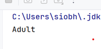

# Conditional statements and boolean expressions

In this step, we will rewrite example Class Exercise 2 to use simple compound boolean expressions, noting that in the if else statement, only one of the statements will be executed, so once one of the boolean expressions is true, the associated statement will be executed and the if else statement will end.
It follows that e.g. below if the boolean condition (age < 4) is true, the statement :

~~~java
System.out.println("Baby"); 
~~~~

will be executed and the if else statement will end.

If the condition (age <13) is being evaluated, it means that (age < 4) was evaluated to false. So the extra condition (age >= 4) is not needed. 

The same applies for the other conditions.

## Class Exercise 3 - Simplify code

In Project **Week4-Class-Exercises**, create a class called IfStatementsExample3 (avoid the temptation to copy and paste it...you learn more by writing the code out):

~~~java
 public static void main(String[] args) {
        int age = 5;
        if (age < 4) {
            System.out.println("Baby");
        }
        else if (age < 13) {
            System.out.println("Child");
        }
        else if (age < 20) {
            System.out.println("Teenager");
        }
        else {
            System.out.println("Adult");
        }
    }

~~~

- Run your code.  Does it work as you would expect?

Change the age to 20, do you get the following outcome?

Is example 3 better written than 2?  