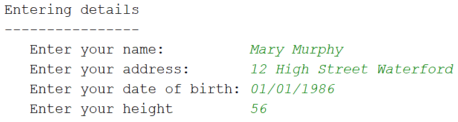
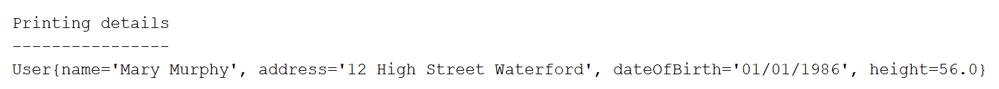

# Challenge

This exercise will help you become more familiar with the Scanner class.

This console based app will ask the user to enter their personal details.  Their details will then be printed back to the console. 

- In IntelliJ, create a new Java Project called **UserDetailsProject**.

- Within this project, create a class called **Driver**.

## Driver Class

-Write a **main** method that asks the user to enter the data and stores it in the corrrect variables, then prints it back to the console
in main() create the following

-  input of type Scanner (initialise this field using **new Scanner(System.in)**) 
-  String name;
-  String address;
-  String dateOfBirth;
-  double height;

## Run the App

Run the app; does all work as expected?  Are you asked to enter the user details?  Are all details you entered printed back to the console?  

