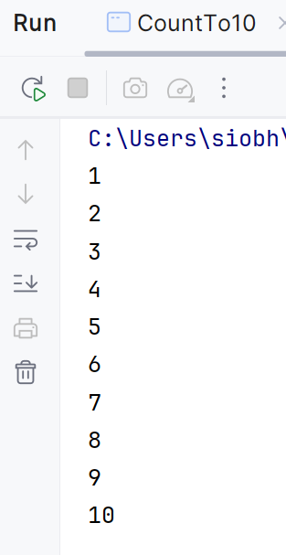
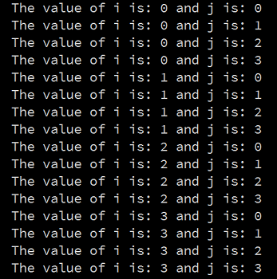

# While Loops

In this step, we will implement the code examples from your lectures.  We will also do an exercise with a nested while loop.

## while Loop

Create a new class and call it **CountTo10**. 

Enter the following code:

~~~java
public class CountTo10 {
    public static void main(String[] args) {

        int i = 1;
        while (i <= 10) {
            System.out.println(i);
            i++;
        }
    }
}
~~~

Run your code.  This code should output 1 to 10

Save your work.

## Nested While Loops

Create a new class and call it **NestedWhileLoop**.

Enter the following code into your class:

~~~java
    public static void main(String[] args) {
        int i = 0;
        while ( i < 4 ) {
            int j = 0;
            while (j < 4 ) {
                System.out.println("The value of i is: " + i + " and j is: " + j);
                j++;
            }
            i++;
        }
    }
~~~

Run your code.  This code should print out the following to your console:

Look at these lines, in particular, look at the values printed for i and for j.  Do you understand the mechanics of how the nested while loop works?  

